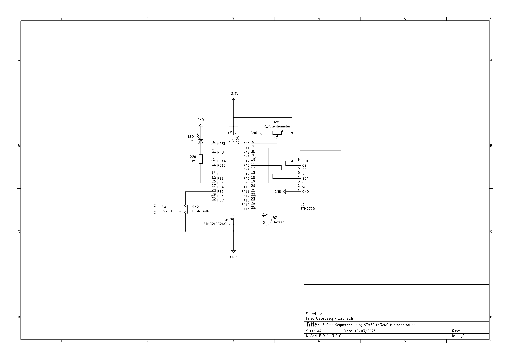
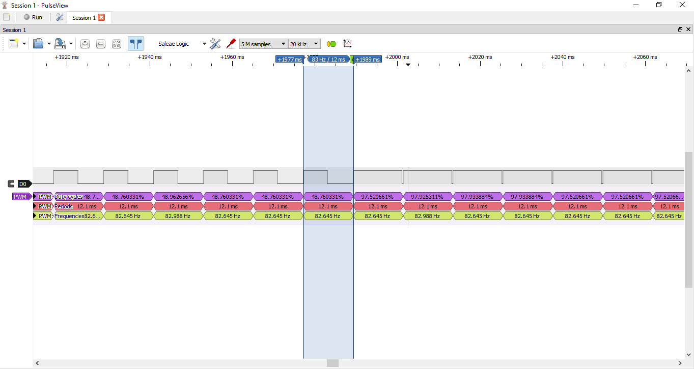
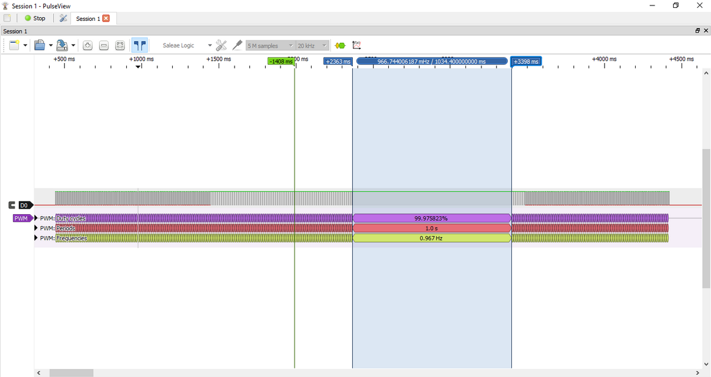

# 8StepSequencerSTM32L432KC
This embedded system makes an 8-step sequencer out of a small amount of components, and has a display functionaility to make it easy to adjust the noise played on each step.

## What is a step sequencer?
A step sequencer is a device or software that plays a sequence of musical notes or beats in a predefined order. It divides time into discrete steps, with each step triggering a noise. Musicians use step sequencers to create rhythms and melodies in electronic music. Users can usually adjust parameters like pitch, velocity, and timing for each step, which is useful when composing music.

## Aim and Objectives

**Aim:**
- The aim of this project is to create an 8-step sequencer on a STM32 L432KC microcontroller. 

**Objectives:**
- To produce an 8-step sequencer that could use digital inputs to adjust the notes played using PWM on each step in the sequence and digital outputs for the ST7735, Buzzer, and LED.
- To use SPI serial communications to send data to an LCD to display the sequence, current step information, and to show current adjustments being made to the sequences steps.
- To use other onboard peripherals when possible such as interrupts, PWM, Serial Comms (Tx and Rx), and timers.
- If possible within the time frame, allow for MIDI communications to and from the board.

# Current Features
- Can store up to 8 notes in a sequence while playing it back in a loop
- The duty cycle of each note is fully adjustable using the potentiometer which is read into the onboard ADC
- A pause button to stop the sequencer playing notes without having to plug the board out.
- LED to indicate when the sequencer is paused
- ST7735 display support (will show step's set duty cycle, the current step being adjusted, and the value being read from the ADC)
> All numerical values on the display (excluding the current step) represent the duty cycle percent. 

## Circuit Schematic

> Image of the circuit schematic that was made using KiCAD
#### Required Hardware Components:
- 1x STM32 L432KC Microcontroller
- 1x ST7735 LCD Display
- 1x 20kΩ Potentiometer
- 2x Push Buttons
- 1x Passive Buzzer
- 1x Red LED
- 1x 220Ω Resistor

#### Other requirements:
- PlatformIO extension on VSCode
- A serial monitor for debugging

#### Pin Config

| Pin  |  Peripheral  | Notes |
|:-----|:------------:|------:|
| PB3   | LED      | Active when PB4 active |
| PB4   | EXTI4    | Toggle on/off TIM1 and SysTick |
| PB5   | EXTI5    | Sets Duty Cycle |
| PA0   | ADC      | Converts analogue signal to digital |
| PA1   | SCL      | SPI Clock |
| PA4   | CS       | Chip Select |
| PA5   | DC       | Data Control |
| PA6   | RES      | Reset |
| PA7   | SDA      | MOSI data into ST7735 |
| PA9   | TIM1     | Used for PWM |

## Documentation

### How to Install
1. Clone the repository

        git clone https://github.com/adrianomars/8StepSequencerSTM32L432KC.git
        cd 8StepSequencerSTM32L432KC

2. Open in VSCode
Use the PlatformIO extension to open the project so that it can be uploaded to the board.

3. Check PlatformIO configuration in `platformio.ini` , it should be set to the board that you are using.

4. Build + Upload the code
Building the code will compile the CSMIS and HAL files and uploading to the board will make it run on the L432KC

### How to use the Sequencer
- Once the circuit has been setup as shown in the schematic, it is possible to just upload the code and use the digital I/O to control the program.
> NOTE: ENSURE THAT WIRES CONNECTING ANY ST7735 PINS ARE AS SHORT AS POSSIBLE DUE TO THE HIGH DATA TRANSFER RATE.
- The program will start with a sequence playing, however it can now be adjusted using the inputs and outputs.
- Using the potentiometer the ADC value can be adjusted between 0 and 4095, however this will be displayed to you as between 0 and 100 on the display. This is a percentage   and represents the duty cycle percentage of the PWM.
- The button connected to PB4 is the pause button, this will activate external line interrupt 4 which disables the PWM (TIM1) and stops SysTick from cycling through the duty cycle array. It must be pressed again to exit pause, which will send another interrupt toggling the pause state flag back to 0 and entering the play state again.
- The button connected to PB5 is the set duty cycle button which will activate external line interrupt 5 which will set the update duty cycle flag to 1. When set to 1 it will set the current step shown on the display to duty cycle shown under duty on the display before incrementing to the next step in the duty cycle array.

### Structure
There is multiple files used with the main file.

| File  |  Purpose  |
|:-----|:------------:|
| main.c   | Contains code for EXTI4, EXTI5, Setup, UART, TIM1, ADC, setTimer2Duty, SysTick Handler, and manages the machine state |
| eeng1030_lib.c | Contains code for initializing System Clock, enabling pull-ups, changing pin modes, selecting alternate functions, and delays |
| display.c   | Contains code for driving the ST7735 LCD Display |
| spi.c | Contains communication protocol which is used to communicate with the ST7735 display. |
| font5x7.h   | Contains the fonts that the display drivers use for writing text and numbers to the ST7735 LCD. |

###

## Testing and Results

### Testing Procedure
- Describe how the project was tested.
- Debugger
The debugger was used to check if bits in registers were being correctly set while the code was running. This was extremely useful for EXTI and

- Logic Analyzer
A logic analyzer was used to check that the PWM signal coming from PA9 were being sent. This was helpful for debugging the

> Image showing testing of PWM signal from PA9 during a duty cycle update.

- Printf using USART
For debugging it was sometimes useful to use printf() to see what value a variable in the code used. This was used to fix a problem in the code where EXTI4 would permanently pause the entire system while EXTI4 was meant to only disable TIM1 and SysTick while the pause state was active. Using printf() for the variable milliseconds showed that SysTick was not incrementing the milliseconds which led to a circular loop as the function which EXTI4 relied on to debounce the button was delay_ms(). This function uses milliseconds to count towards the end of delay so this caused the infinite delay. This was then able to be fixed easily by adding a second tick counter variable and using an if statement to stop SysTick from updating the counters, rather than entirely disabling SysTick.

      // Print milliseconds through serial for debugging SysTick (uncomment to use)
      printf("%ld \n",milliseconds);
  
> This is the code used for printing the milliseconds

### Results
- Summarize the key outcomes and observations.

Most of the aims of the project were met, however a MIDI communications using UART were not achieved due to time constraints. The logic analyzer shows that the 

## Video Demo of the Project
This video shows a demonstration of all of the features of the project as of 22/03/2025

